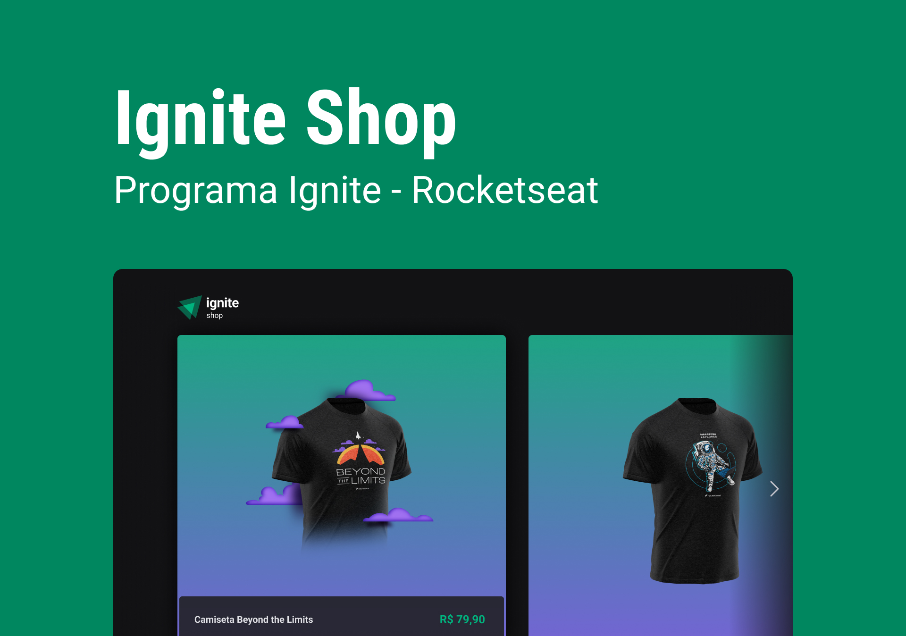
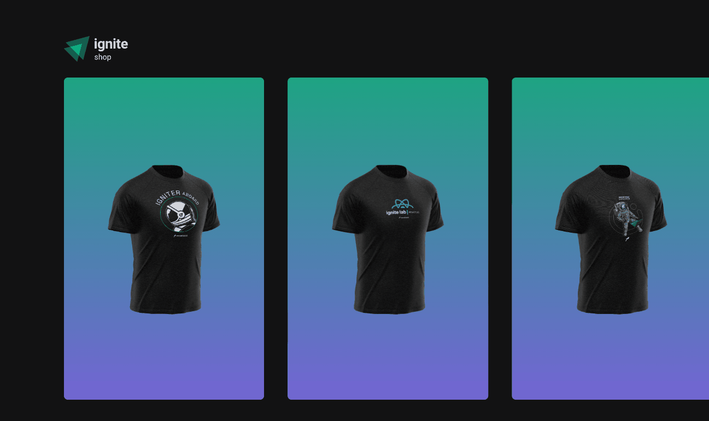

<h1>Estudos Ignite(React) - Etapa 04</h1>

 

<h2 id="course">Projeto feito durante as aulas</h2>

caminho: "/projects/practice04"

 

    Este é um projeto de um site simples de venda de camiseta feito Next, utilizando o stripe.

<h3>🚀 Tecnologias</h3>
<ul>
    <li>Next</li>
    <li>Tailwind</li>
    <li>Stitches</li>
    <li>Phosphor-react</li>
    <li>stripe</li>
    <li>axios</li>
</ul>

 
 
<h2>💻 Projeto</h2>

<ul>

 
<li>
<h3>Home - "/"</h3>

Listagem de camisetas utilizando SSG, as informações das camisetas vem através do consumo da API do Stripe(onde cadastramos nosso produto), essa requisição
é feita na função getStaticProps, e os dados são retornados para o componente pelas propriedades, essa propriedades são atualizadas a partir de 2 horas pela configuração do SWR.

<kbd></kbd>
</li>

 
<li>
<h3>Página de comprar camiseta - "/produtos/[id]"</h3>

Esta página tem as informações do produto para a realização da compra. Por ter um parâmetro dinâmico e usarmos SSG, utilizei a função getStaticPaths, com
fallback igual a true. Também é consumida uma API route, para obtermos o link do checkout ao clicar no botão, ao obter o link, o usuário é redirecionado.

<kbd></kbd>
</li>

 
<li>
<h3>Processo de pagamento e página de sucesso - "/sucesso"</h3>

Para efetuar o pagamento o usuário é redirecionado a plataforma do Stripe. Ao confirmar a compra o usuário é redirecionado para a página de sucesso,
onde ocorre a busca os dados da compra com SSR, e a página é carregada já com os dados da compra.

<kbd></kbd>
</li>

</ul>

 
 
<h2 id="course-individual">Projeto do curso feito individualmente</h2>

caminho: "/projects/practice03"

 

    Foi o mesmo projeto do acima, porém as compras são realizadas a partir do carrinho, esse carrinho foi feito utilizando a context API.

